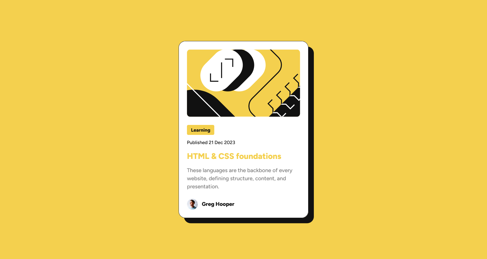

# Frontend Mentor - Blog preview card solution


This is a solution to the [Blog preview card challenge on Frontend Mentor](https://www.frontendmentor.io/challenges/blog-preview-card-ckPaj01IcS). Frontend Mentor challenges help you improve your coding skills by building realistic projects.

## Table of contents

- [Frontend Mentor - Blog preview card solution](#frontend-mentor---blog-preview-card-solution)
  - [Table of contents](#table-of-contents)
  - [Overview](#overview)
    - [The challenge](#the-challenge)
    - [Screenshot](#screenshot)
    - [Links](#links)
  - [My process](#my-process)
    - [Built with](#built-with)
    - [What I learned](#what-i-learned)
    - [Continued development](#continued-development)
    - [Useful resources](#useful-resources)
  - [Author](#author)
  - [Acknowledgments](#acknowledgments)

## Overview

### The challenge

Users should be able to:

- See hover and focus states for all interactive elements on the page

### Screenshot




### Links

- Solution URL: [Github](https://github.com/newbpydev/blog-preview-card-angular-18-scss-ssr)
- Live Site URL: [Add live site URL here](https://your-live-site-url.com)

## My process

### Built with

- Semantic HTML5 markup
- SCSS custom properties
- Flexbox
- Mobile-first workflow
- [Angular v18](https://angular.dev/) - Angular v18

### What I learned

For this project I have learned more about SCSS mixins. It is a simple project that uses
Angular 18, a bit of an overkill but I wanted to ger more practice with its latest
features in version 18.

The code that I am proud of implementing was the responsive mixin
that with a few modification could many any property responsive with one function.

See below:

```scss
@mixin responsive($property, $value-mobile, $value-laptop: none, $value-desktop: none) {
  #{$property}: $value-mobile;

  @if ($value-laptop !=none) {
    @media (min-width: $width-laptop) {
      #{$property}: $value-laptop;
    }
  }

  @if ($value-desktop !=none) {
    @media (min-width: $width-desktop) {
      #{$property}: $value-desktop;
    }
  }
}
```

```scss
.blog-card {
  &__image {
    display: block;
    height: 200px;
    @include mix.responsive(scale, 1.2, 1);
  }
}
```

### Continued development

As I continue going through the learning path of Frontend Mentor, I will continue explore
more SCSS features. I will so implement more semantic and best practices when it comes to
naming conventions and HTML elements.

### Useful resources

- [Angular Signal](https://angular.dev/guide/signals) - Angular Signals is a system that granularly tracks how and where your state is used throughout an application, allowing the framework to optimize rendering updates.
- [SCSS Mixins](https://sass-lang.com/guide/#mixins) - A mixin lets you make groups of CSS declarations that you want to reuse throughout your site. It helps keep your Sass very DRY. You can even pass in values to make your mixin more flexible.

## Author

- Website - [Juan Gomez](https://github.com/newbpydev)
- Frontend Mentor - [@newbpydev](https://www.frontendmentor.io/profile/newbpydev)
- Twitter - [@Newb_PyDev](https://twitter.com/Newb_PyDev)

## Acknowledgments

The code may not be perfect compared to my sensei @jonasschmedtman but I need to thank him because he has shown me the ropes and now I am a confident web
designer. Another important instructor is @MaximilianSchwarzmüller in Udemy.
